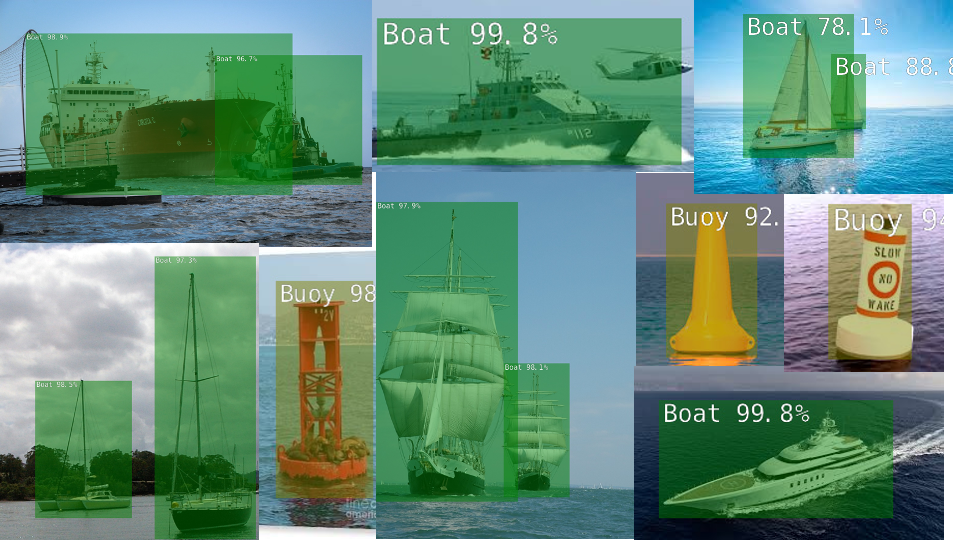
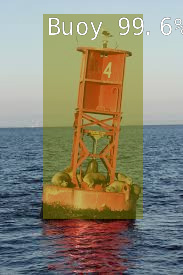
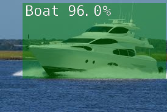
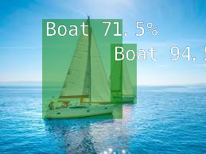
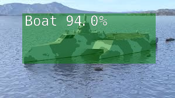
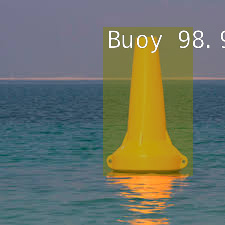

# Pytorch-SSD for Marine Objects 4.4
The objective of this project is to identify marine objects (Boat, Buoy) using the newest pytorch-ssd from @dustu-nv that exploits the capabilities of JP4.4. This marine ssd repository was first inspired by Mr. Franklin’s (@dusty-nv) original pytorch-ssd GitHub repository found at the following link:

https://github.com/dusty-nv/pytorch-ssd

Mr. Franklin has since enhanced this method and it is now includes in his latest jetson-inference repository found at the following link:

https://github.com/dusty-nv/jetson-inference/blob/master/docs/pytorch-ssd.md

This is a Single Shot MultiBox Detector method of object detection using MobilNet. For this repository we basically followed his latest tutorial as documented except that we used a marine theme and not fruit. 

>

This pytorch-ssd method has matured nicely.  It is now very easy to apply and appears to be a very good object detection technique taking advantage of the Jetson GPU capabilities. 

>

We first completely updated our jetson-inference project with Dusty's latest code and installed all of the requirements. 

# Download additional images with labels:
We took advantage of open_image_downloader.py in accessing additional images with labels in the open_image format running the following command:

	python3 open_images_downloader.py --class-names "Boat"

This could result in downloading a huge number of images so we chose to download only 2500 images using the following command: 

	python3 open_images_downloader.py --max-images=2500 --class-names "Boat"

We are running our ssd programs out of the /jetson-inference/python/training/detection/ssd/ subdirectory, but with the recommended install and compiling this pytorch-ssd technique can be run from any directory. 

The data download was very simple creating the 	/data/train/
					  	/data/test/
					  	/data/validation/

subdirectory with images and the annotations .csv files in the /data/ subdirectory: 

    sub-train-annotations-bbox.csv
    sub-test-annotations-bbox.csv
    sub-validation-annotations-bbox.csv
    class-description-bbox.csv

The comma delimited .csv files as shown above with labels with object boxes for each label. 

In the same process we also downloaded the following .csv files that have every annotations and box for each image too:

    train-annotations-bbox.csv
    test-annotations-bbox.csv
    validation-annotations-bbox.csv

We have not used the above full annotation .csv files at this point and are only working from the sub... files. We are wondering if these large annotation files can be used with mobilnet-v1-ssd-mp-0_675.pth pretrained model and the training images to observe the original box selections? 

# Supplement Downloaded data with our Existing Marine Images and Labels:
'Boat' was the only pretrained object available to us, and we also needed Buoy labeled images too. We supplemented the download data with our own marine dataset from JP4.3 found in this GitHub Philliec459 suite of repositories. We added our marine data to the newly downloaded images and included the labels in the .csv annotation files.

# Training
To train our full marine dataset we used the following command:

	python3 train_ssd.py --model-dir=models/marine --batch-size=4 --num-epochs=60

Training first populates our /models/marine/ subdirectory with a label.txt file to define our classification scheme and creates mb1-ssd-Epoch-x-Loss-xxxxxxx.pth files for each Epoch in the models/marine subdirectory. Training ran well without any issues. 

We  found the --resume command to be useful in running additional Epochs from where you last left off. 

	python3 train_ssd.py --model-dir=models/marine --batch-size=4 --num-epochs=60 --resume=/home/craig/src/jetson-inference/python/training/detection/ssd2/models/marine/mb1-ssd-Epoch-9-Loss-3.176339123307205.pth

The --resume command is supposed to start off from the .pth file that you give it, but the Loss in this second training session appears to be higher than where you last left off. Using an additional 60 Epochs we barely got back to what we had before and the Loss was a little lower.  

Once the training was complete, we then ran the following command to create the ssd-mobilnet.onnx file by using the following command:

	python3 onnx_export.py --model-dir=models/marine

The onnx file was made from the existing .pth file that is automatically taken from the lowest Epoch Loss .pth file. The onnx file is used to run detectnet and make the final marine object detection estimates. 

To evaluate our results we created an image subdirectory and loaded a series of Boat and Buoy images to observe how well the program performed. 

First, 

	mkdir test_marine

then we ran detectnet on all the .jpg images from the image subdirectory:

	detectnet --model=models/marine/ssd-mobilenet.onnx --labels=models/marine/labels.txt \
          --input-blob=input_0 --output-cvg=scores --output-bbox=boxes \
            "images/*.jpg" test_marine

# Revise new downloaded data to create high-quality marine dataset for training:
Detectnet did a fair job of boxing in the Boats and Buoys from the initial download data supplemented with our own marine dataset. However, we were not completely satisfied. 

We reviewed each of the newly downloaded data images in the train, test and validation subdirectories and removed images that were not representative from our  perspective or lacked object details. Obviously, an image of a fleet boats taken from a plane is not the perspective that we are looking for from our at-sea object detection project taken from a boat. We also eliminated images of a boat taken from the interior of a boat or images with people or irrelevent objects with a boat somewhere in the background. We culled these images to create a higher quality dataset of training/testing/validation images for our ssd object detection. After training with this new set this produced a new model with a Loss of 1.85 using just 60 Epochs.

As stated above, we did remove images from the test/train/validation subdirectories that did not appear to be suitable. However, we did not remove those image labels from our .csv files. Being able to select unwanted images from the photos is one thing, but finding those record in the .csv files is a undaunting task that we chose not to attemt. During the ssd training, the program did actually indicate which images were missing. It would have been nice to automatically been able to remove those entries from the .csv files since they were alread identified. 

At least from this simple experiment and not seeing all the labels it appears that it was advantageous to inspect the newly downloaded data and remove images that did not appear to fit the perspective of this project; however, statistically this could have had a negative impact too. Using the following command we have some test results below: 

	detectnet --model=models/marine/ssd-mobilenet.onnx --labels=models/marine/labels.txt \
          --input-blob=input_0 --output-cvg=scores --output-bbox=boxes \
            "images/*.jpg" test_marine

# Test Results:

>
>
>
>
>
>
>
>
>

Once this technique is installed on the boat and fully deployed we will use something like the following command to perform our real-time video object detection while at sea with alarms. 

	detectnet --model=models/fruit/ssd-mobilenet.onnx --labels=models/fruit/labels.txt \
          	--input-blob=input_0 --output-cvg=scores --output-bbox=boxes \
            	/dev/video1

# Appendix:
## Command lines used in the jetson-inference pytorch-ssd processing using JP4.4:
### Install:
	cd jetson-inference/python/training/detection/ssd
	wget https://nvidia.box.com/shared/static/djf5w54rjvpqocsiztzaandq1m3avr7c.pth -O models/mobilenet-v1-ssd-mp-0_675.pth
	pip3 install -v -r requirements.txt

### Download:
	#python3 open_images_downloader.py --class-names "Boat"  - too many boats with labels too, good but huge

	python3 open_images_downloader.py --max-images=2500 --class-names "Boat"

	#added all of our marine Boat and Bouy data to train, test and validation sets including .csv file additions too.

### Train:
	Defaults Of Training: Balance_Data=False, Base_Net=None, Base_Net_Lr=0.001, Batch_Size=4, Checkpoint_Folder='Models/Marine', Dataset_Type='Open_Images', 	Datasets=['Data'], Debug_Steps=10, Extra_Layers_Lr=None, Freeze_Base_Net=False, Freeze_Net=False, Gamma=0.1, Lr=0.01, Mb2_Width_Mult=1.0, 		Milestones='80,100', Momentum=0.9, Net='Mb1-Ssd', Num_Epochs=10, Num_Workers=2, Pretrained_Ssd='Models/Mobilenet-V1-Ssd-Mp-0_675.Pth', Resume=None, 	Scheduler='Cosine', T_Max=100, Use_Cuda=True, Validation_Epochs=1, Weight_Decay=0.0005

	python3 train_ssd.py --model-dir=models/marine --batch-size=4 --num-epochs=60

	python3 train_ssd.py --model-dir=models/marine --batch-size=4 --num-epochs=60 --resume=/home/craig/src/jetson-	inference/python/training/detection/ssd/models/marine/mb1-ssd-Epoch-99-Loss-1.8643740839079808.pth

### Create ONNX file:
	python3 onnx_export.py --model-dir=models/marine

### Review Object Detection:
	detectnet --model=models/marine/ssd-mobilenet.onnx --labels=models/marine/labels.txt \
          	--input-blob=input_0 --output-cvg=scores --output-bbox=boxes \
		    "images/boat*.jpg" test_marine

	detectnet --model=models/marine/ssd-mobilenet.onnx --labels=models/marine/labels.txt \
          	--input-blob=input_0 --output-cvg=scores --output-bbox=boxes \
            	/dev/video1

	detectnet --model=models/marine/ssd-mobilenet.onnx --labels=models/marine/labels.txt \
          --input-blob=input_0 --output-cvg=scores --output-bbox=boxes \
            ./buoy_boats.mp4

	detectnet --model=models/marine/ssd-mobilenet.onnx --labels=models/marine/labels.txt \
          --input-blob=input_0 --output-cvg=scores --output-bbox=boxes \
            ./sail.mp4

	detectnet /dev/video1

